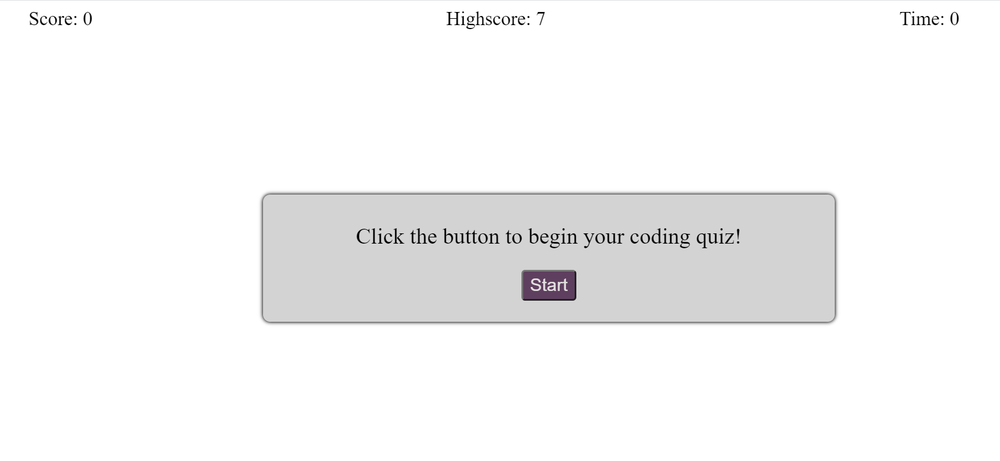

# Coding Quiz

This application will test your knowledge with various coding questions

From the start page you can start the quiz. A timer starts and the quiz will go through 10 questions. With each correct answer chosen the score will increase and display at the top of the screen. When the quiz ends or the time reaches 0 your score will be saved and if it is more than the current highscore it will be displayed at the top of the screen.

### Link to page

[Coding Quiz](https://tniles320.github.io/coding-quiz/)